# Wedding Palace - Adminitrastor page :house::sunflower:

---

## Components of a website project

- **Backend**: `ASP.NET CORE 6` `Blazor Server` `Web API`
- **Frontend**: `ReactJS`
- **Database**: `SQL Server`
- **Tools**: `Mailtrap.io` `SignalR` `Docker Compose` `Google Calendar API` `Cloudinary`

---

## Project hosting

- **[https://administrator-wedding-palace.somee.com](https://administrator-wedding-palace.somee.com)**

## User Interface

- **Dashboard**

  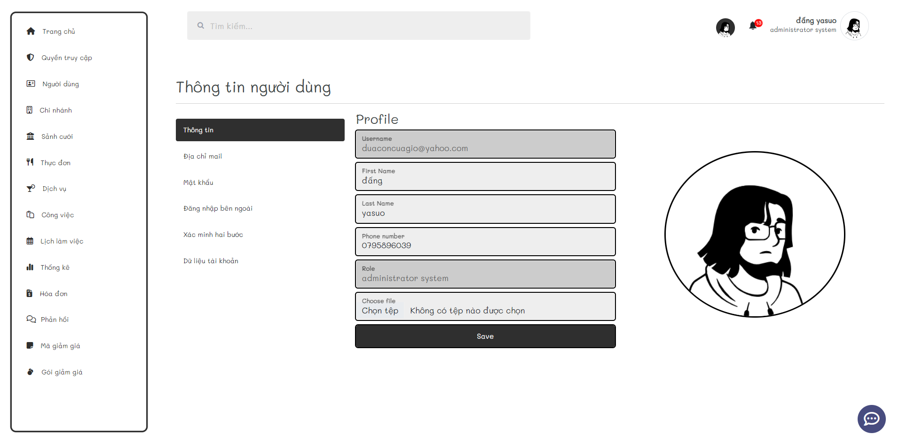

- **Register and login**

  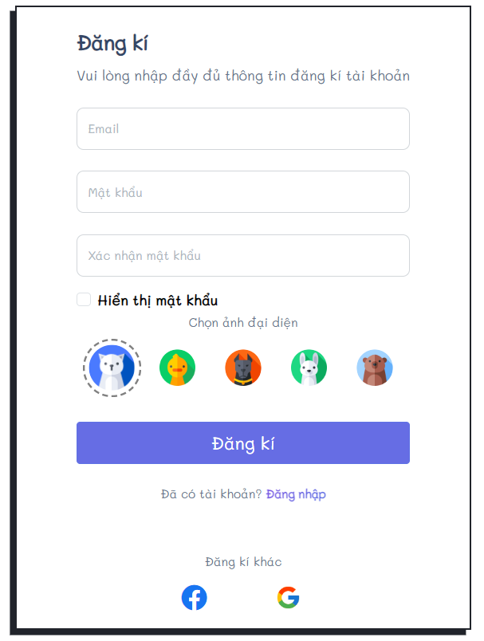 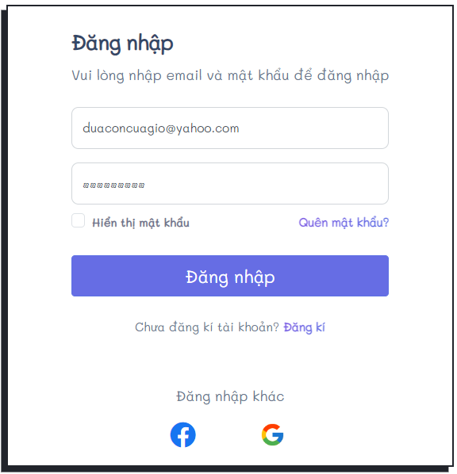

- **Project manager**

  

- **Authorized Roles**

  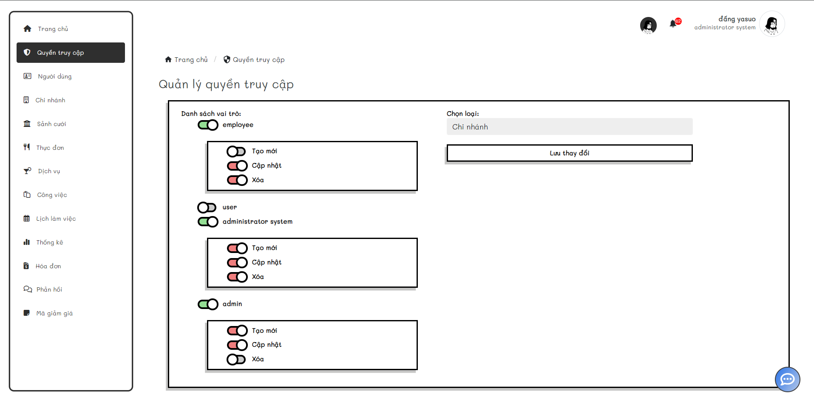

- **Chat realtime**

  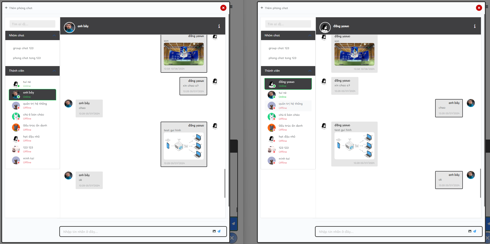

---

## Setup environment

- **SDK net core 6**
- **Server Management Studio 2019**
- **Visual Studio 2022**

---

## How to run project

1.  **_Get server name in SSMS_**

    - Open SSMS

    - Right click > choose **`Properties`** then get **`Server name`**

      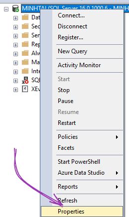 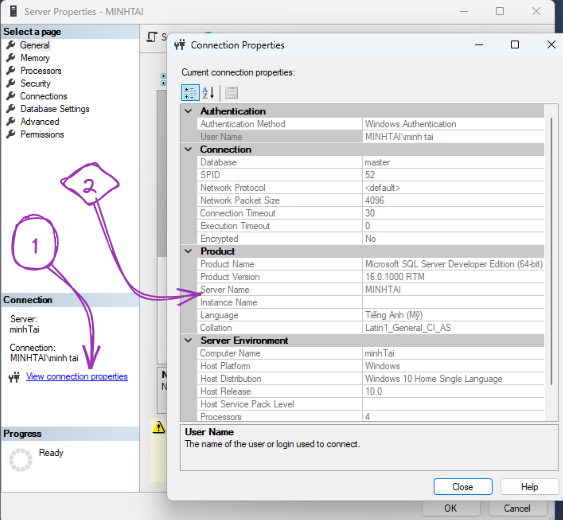

---

2.  **_Run ASP.Net Core Project_**

    - Double click **`CodeFirst.sln`** to open project

      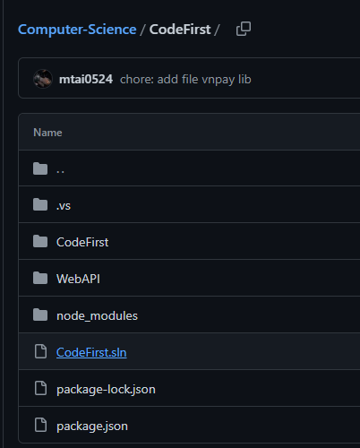

    - Open file `appsetting.json` and change **`Server name`**

      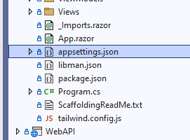 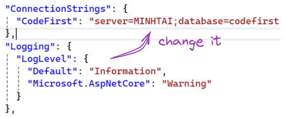

    - Then open `package manage console` on visual studio code 2022

      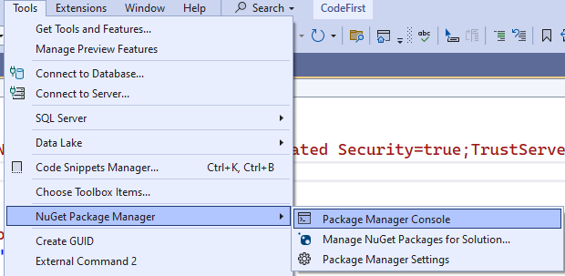

    - Finally just run `update-database` to update database in SQL Server

      

---

## Account administrator

nguyentai24052002@gmail.com
**`Tai12345.`**

## Account employee

duaconcuagio@yahoo.com
**`Tai12345.`**

## Account user

demodoan@gmail.com
**`Tai12345.`**
