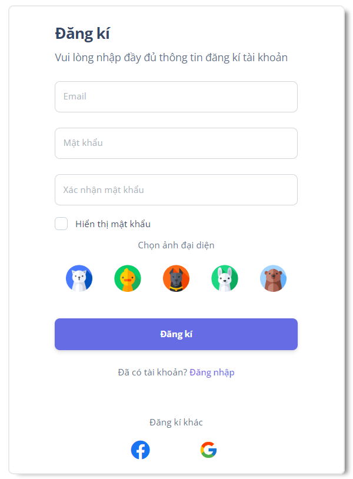
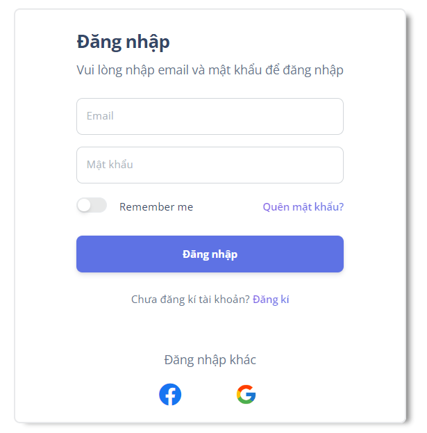

# Manage Wedding Restaurant :house::sunflower:

---

## Components of a website project

- **Backend**: `ASP.NET CORE 6` `Blazor Server` `Web API`
- **Frontend**: `ReactJS`
- **Database**: `SQL Server`

---

## Project hosting

- **[http://aspnetcore123-001-site1.jtempurl.com/](http://aspnetcore123-001-site1.jtempurl.com/)**

## User Interface

- **Dashboard**

  

- **Register and login**

   

---

## How to run project

1.  **_Get server name in SSMS_**

    - Open SSMS

    - Right click > choose **`Properties`** then get **`Server name`**

       

---

2.  **_Run ASP.Net Core Project_**

    - Double click **`CodeFirst.sln`** to open project

       

    - Open file `appsetting.json` and change **`Server name`**

       

    - Then open `package manage console` on visual studio code 2022

      

    - Finally just run `update-database` to update database in SQL Server

      

---

## Account administrator

nguyentai24052002@gmail.com
**`Tai12345.`**

## Account employee

duaconcuagio@yahoo.com
**`Tai12345.`**

## Account user

demodoan@gmail.com
**`Tai12345.`**
